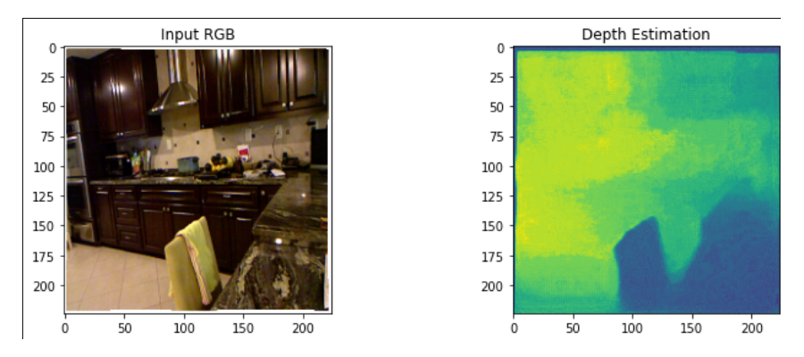

## Monocular Depth estimation for interior scenarios in real time on Kria KV260
From a single RGB image, infer in real-time with a Kria KV260 a depth map using convolutional neural networks.

### AMD Open Hardware 2024
### Team number: AOHW-305
Participants:
- Nicolás Urbano Pintos (UTN FRH /CITEDEF)
- Monal Patel Rakeshbhai (UMONS)

Supervisor:
- Carlos Valderrama (UMONS)

Steps:


- Train a U-NET model with NYUDEPTHV2 dataset in pytorch.
- Quantize the model with VITIS AI.
- Compile the quantized model for DPU.
- Evaluate the model in the Kria KV260 

## Prepare conda env for training
In a linux pc with conda:
```console
conda create -n mde_unet-env
conda activate mde_unet-env
git clone https://github.com/nurbano/mde-unet-kv260
cd mde-unet-kv260
pip install requirements.txt
```


## Prepare Dataset
1- Download the dataset from http://datasets.lids.mit.edu/fastdepth/data/nyudepthv2.tar.gz
2- Extract the dataset. The directory structure is:
```
nyudepthv2
│
└───train
│   │
│   └───basement_0001a
│   │       │   00001.h5
│   │       │   00006.h5
│   │       │   ...
│   └───basement_0001b
│   │       │   00001.h5
│   │       │   00006.h5
│   │       │   ...
│   └───...
│   │   
└───val
    │ 
    └───official
    │       │   00001.h5
    │       │   00002.h5
    │       │   ...
```
                                                         
## Train
To train the model use this script:
```console
python train.py -d /path/to/nyudepthv2 -e 20 -n 5000
```  
The arguments are:

```console
Command line options:
 --dataset_dir    :  /path/to/
 --epochs      :  20
 --num_img      :  5000
 --evaluate      :  False
 --model_path      :  ./model.pth
```
For this project, the model was training with 50k images and 50 epochs. And the default losses (L1) and default optimizer (AdamW) with a lr=0.0001. The 50k images was subset in 90% for training and 10% for validate.

## Evaluate in PC
For evaluate the model in PC, run the jupyter notebook infer.ipynb in the conda env. To launch jupyter lab use:
```console
jupyter lab
```
You can download our trained model from: https://drive.google.com/file/d/1JBq8XnR-XfEQ6-DKiAEY3ZmbbWS5OZOy/view?usp=sharing
## Prepare the Vitis AI 1.4.1 for CPU
In a ubuntu PC:
- First install docker:
```console
sudo apt-get install docker-ce docker-ce-cli containerd.io docker-buildx-plugin docker-compose-plugin
```
- Manager Docker as non-root user:
```console
sudo groupadd docker
sudo usermod -aG docker $USER
newgrp docker
```
- Clone the Vitis AI repository:
```console
  git clone --recurse-submodules --branch 1.4.1 https://github.com/Xilinx/Vitis-AI
```
- Go to the Vitis AI directory:
```console
  cd Vitis-AI
```
- Pull the pre-built docker image:
```console
  docker pull xilinx/vitis-ai-cpu:1.4.1.978
```
- Modify the docker_run.sh bash to add the path of the dataset. After the line 93 include this: -v /path/to/nyudepthv2:/workspace/Dataset/nyudepthv2
- Run the docker:
```console
./docker_run.sh xilinx/vitis-ai-cpu:1.4.1.978
```
- Activate the conda environment for pytorch:
```console
conda activate vitis-ai-pytorch
```
- Create a directory for the project:
```console
mkdir custom_ai_model
```
- Is necessary copy this repository directory to path/to/Vitis-AI/custom_ai_model

## Quantize
First calibrate the quantize model.
```console
python3 quantize.py -q calib -b 4
```
And then test the quantized model
```console
python3 quantize.py -q test
``` 
## Compile for DPU
```console
bash compile.sh kv260
```
## Prepare the SD for kria kv260
For this project is necessary use the Ubuntu 20.21, download the image from:
https://people.canonical.com/~platform/images/xilinx/kria/iot-kria-classic-desktop-2004-x03-20211110-98.img.xz?_gl=1*16usueu*_gcl_au*Mzk5MTE0ODkyLjE3MTExMDYyMjg.&_ga=2.59807085.1133415059.1711106229-1097448103.1710778457
- Extract the image:
```console
unxz iot-limerick-kria-classic-desktop-2204-x07-20230302-63.img.xz
```
- Format a SD:
```console
mkfs.exfat /dev/sdd
```
- Copy the img to the sd:
```console
dd if=iot-limerick-kria-classic-desktop-2204-x07-20230302-63.img of=/dev/sdd conv=fsync status=progress
```
- To setup the Kria KV260 following the steps of this link:
  https://www.amd.com/en/products/system-on-modules/kria/k26/kv260-vision-starter-kit/getting-started/getting-started.html
## Install KRIA-PYNQ
```console
git clone https://github.com/Xilinx/Kria-PYNQ.git
cd Kria-PYNQ/
sudo bash install.sh -b KV260 
```
## Evaluate the model in the kria kv260
- Open the jupyter lab in the browser with
```console
<ip_address>:9090/lab
```
- In the file manager of jupyter lab upload the file mde_kv260.tar.xz.
- Open the terminal inside the jupyter lab and extract the tar.gz with:
```console
tar –xvzf mde_kv260.tar.xz
```
- In the file manager of jupyter lab you can see the directory estructure
```
mde_kv260
│
└───images
│   │   1.png
│   │   1.npy
│   │   2.png
│   │   2.npy
│   │   ...
│   │   
    unet.ipynb
    CNN_KV260.xmodel
```
- Open the notebook unet.ipynb and run all cell to evalauate the model in the kria kv260.



